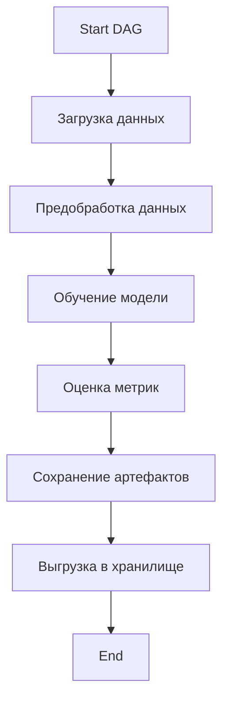
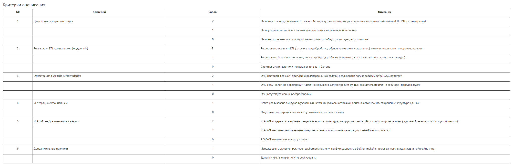

# 🧠 ML-пайплайн с Apache Airflow: Диагностика рака молочной железы

## 🎯 Цель проекта
Автоматизация и оркестрация пайплайна машинного обучения на основе датасета Breast Cancer Wisconsin Diagnostic.  
Цель — построить воспроизводимую систему, которая:
- автоматически загружает и обрабатывает данные,
- обучает модель Logistic Regression,
- сохраняет результаты (метрики и модель) в облачное или локальное хранилище,
- управляется через Apache Airflow.

---

## 📂 Структура проекта

```
project/
├── dags/                # DAG-файл для оркестрации
│   └── pipeline_dag.py
├── etl/                 # Скрипты ETL и ML
│   ├── load_data.py
│   ├── preprocess.py
│   ├── train_model.py
│   ├── evaluate_model.py
│   └── save_results.py
├── results/             # Модель и метрики
├── logs/                # Логи Airflow
├── images/              # Скриншот DAG
├── requirements.txt     # Зависимости проекта
├── config.yaml          # Конфигурация (опционально)
└── README.md            # Документация
```

---

## 🧠 ML-задача
Задача бинарной классификации: определить, является ли опухоль злокачественной (`M`) или доброкачественной (`B`), используя 30 признаков, извлечённых из медицинских изображений.

---

## 🔄 Архитектура пайплайна



---

## ⚙️ Архитектурные решения

- Каждый шаг реализован как модуль в `etl/` и подключается в Airflow через `PythonOperator`
- Используется `joblib` и `pickle` для сериализации объектов
- Все промежуточные данные и артефакты сохраняются в `results/`
- Возможна замена локального хранения на облачное с минимальными изменениями
- В конфигурации можно задать путь к данным и параметрам модели (через `config.yaml` или переменные окружения)

---

## 📈 Описание шагов пайплайна

1. **load_data.py** — загрузка CSV-файла, переименование колонок
2. **preprocess.py** — удаление лишнего, нормализация, преобразование целевой переменной
3. **train_model.py** — обучение `LogisticRegression` с `max_iter=1000`
4. **evaluate_model.py** — расчет метрик: Accuracy, Precision, Recall, F1
5. **save_results.py** — сохранение модели `.pkl` и метрик `.json`
6. **pipeline_dag.py** — управление пайплайном через Airflow

---

## 🚀 Запуск DAG в Airflow

1. Запуск Airflow:
```bash
docker-compose up
```

2. В интерфейсе: http://localhost:8080  
   Логин: `admin`, Пароль: `admin`

3. Запуск вручную или через CLI:
```bash
airflow tasks test ml_pipeline_breast_cancer load_data 2024-01-01
```

---

## ☁️ Интеграция с хранилищем

В базовой версии реализовано локальное сохранение в папку `results/`.  
Можно легко заменить функцию `save_to_local_storage()` на выгрузку в:
- Google Drive API (через `pydrive` и `credentials.json`)
- Amazon S3 (через `boto3`)
- Dropbox API (через `dropbox-sdk`)

Пример формата метрик:
```json
{
  "accuracy": 0.96,
  "precision": 0.97,
  "recall": 0.95,
  "f1_score": 0.96
}
```

---

## 🛡️ Анализ отказов и устойчивости

| Возможный сбой | Предусмотрено решение |
|----------------|------------------------|
| Отсутствие файла | Проверка пути и исключения |
| Ошибки модели | try/except с логами |
| Неудачное подключение к API | можно реализовать `retries` |
| Невалидные данные | валидация и удаление пустых значений |
| Падение Airflow-задачи | `retries`, `timeout`, `catchup=False` |

Все шаги изолированы и не ломают весь DAG при сбое.

---

## 🧪 Скриншот DAG



---

## ✅ Дополнительные практики

- `requirements.txt` для зависимостей
- Возможность подключения `.env` (через `os.getenv()`)
- Поддержка конфигурационного файла `config.yaml`
- Mermaid-диаграмма архитектуры

---

## 💡 Идеи для развития

- Интеграция с облаком
- Выгрузка PDF-отчета по метрикам
- Алерты в Telegram при падении пайплайна
- Расширение пайплайна на другие модели (SVM, Random Forest)

---

## 📎 Источник данных

- [UCI Breast Cancer Wisconsin (Diagnostic)](https://archive.ics.uci.edu/ml/datasets/Breast+Cancer+Wisconsin+(Diagnostic))